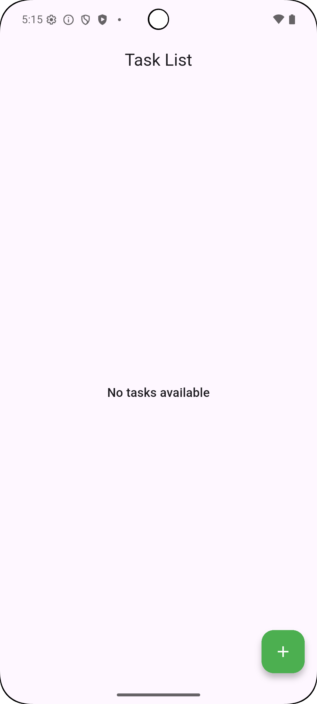
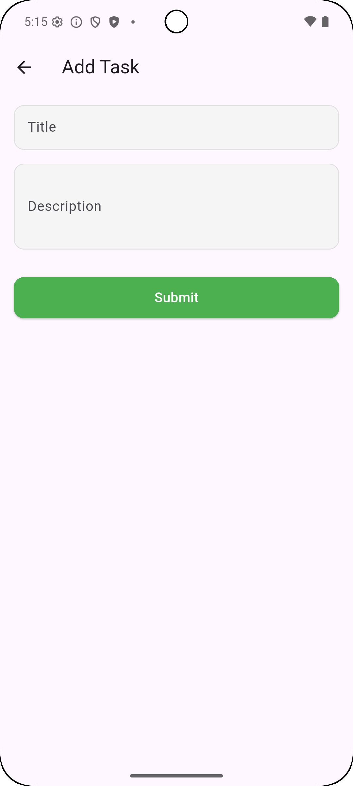
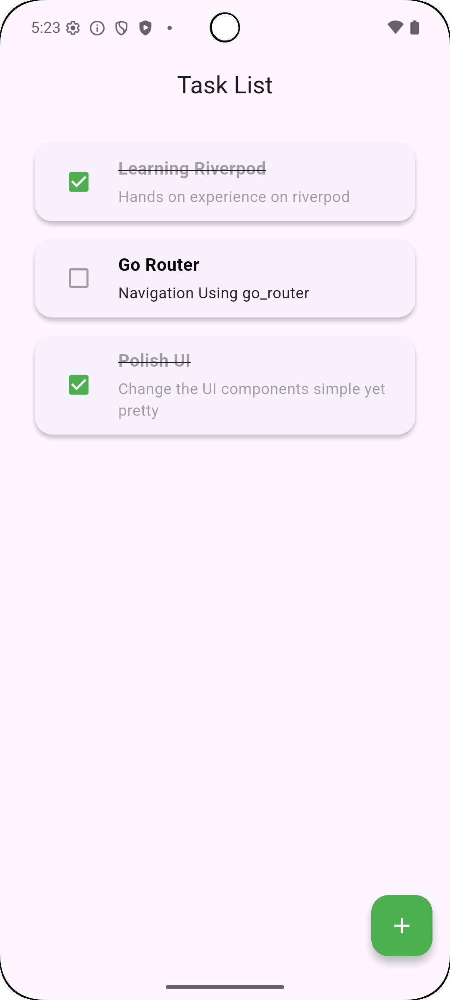

# Task Manager App

A lightweight and clean Task Manager app built with Flutter and Riverpod following Clean Architecture principles. It supports task CRUD operations with persistent local storage using SQLite.

## Table of Contents
- [Demo](#-demo)
- [Features](#-features)
- [Technologies Used](#-technologies-used)
- [Installation & Usage](#-installation--usage)
- [Motivation](#-motivation)
- [Architecture/Design](#-architecturedesign)
- [Topics](#-topics-)
- [Packages Used](#-packages-used)
- [QA](#-qa)
- [Explore](#-explore-)
- [Related Projects](#-related-projects)

## 🎥 Demo

<table>
  <tr>
    <td>Empty List</td>
    <td>Task List</td>
    <td>Add Task</td>
  </tr>

  <tr>
    <td></td>
    <td></td>
    <td></td>
  </tr>

 </table>
 

## 🚀 Features

- Add new tasks with title and description
- Mark tasks as complete/incomplete
- Delete tasks with confirmation dialog
- Update task status directly from the list
- Persist tasks locally using SQLite
- State management with Riverpod
- Responsive and styled UI with modern Flutter widgets

## 🛠️ Technologies Used

- Flutter (Dart)
- Riverpod for state management
- SQLite (Sqflite package)
- Clean Architecture (Data, Domain, Presentation layers)

## 🚧 Installation & Usage

1. Clone the repository:  
   `git clone https://github.com/alxayeed/riverpod-task-manager.git`
2. Navigate to the project directory:  
   `cd task-manager-app`
3. Get dependencies:  
   `flutter pub get`
4. Run the app:  
   `flutter run`

## 📃 Motivation

This project was built to deepen understanding of scalable app architecture in Flutter using Clean Architecture, Riverpod for state management, and local storage with SQLite — all while building something practical and minimal.

## 🏛️ Architecture/Design

- Clean Architecture (Domain ➝ Use Cases ➝ Repositories ➝ Data Sources)
- MVVM-like presentation with Riverpod Notifiers and Widgets
- Separation of concerns with `features` and `core` directories

## 🌟 Topics

- Flutter state management with Riverpod
- SQLite database integration in Flutter
- Local persistent storage
- Clean and modular Flutter project structure
- UI/UX best practices with Material Design

## 📦 Packages Used

- [flutter_riverpod](https://pub.dev/packages/flutter_riverpod)
- [sqflite](https://pub.dev/packages/sqflite)
- [path_provider](https://pub.dev/packages/path_provider)

## ❓ QA

#### Q: Does the app support offline mode?
<pre>
A: Yes, since it uses local storage with SQLite, all data is offline.
</pre>

#### Q: Can I switch to a remote backend later?
<pre>
A: Yes, thanks to the clean architecture setup, you can easily swap the data source layer with a remote backend (e.g., Firebase or Supabase).
</pre>

## 📖 Explore

- Replace SQLite with Firebase or Supabase
- Add Task Categories or Labels
- Implement Dark Mode support
- Add Search & Filter functionality
- Schedule tasks with notification support

## 📌 Related Projects

Check out my other pet projects:
- [Car Workshop](https://github.com/alxayeed/car_workshop)
- [Job Search](https://github.com/alxayeed/job_search_app)

